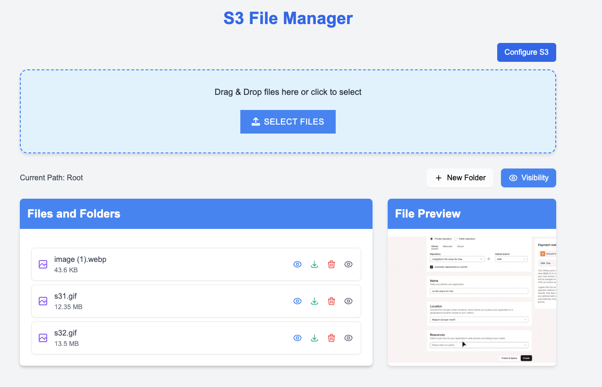

<div align="center">
  <!--  -->
  <h1>Cloud Storage Manager</h1>

  <h5>
    A modern web application for managing files across multiple cloud storage providers with a clean and intuitive interface.
    <br />
    Features intelligent document processing, AI-powered classification, and multi-cloud support.
  </h5>
</div>

---

## 📚 Table of Contents

- [🛠️ Stacks \& Features](#️-stacks--features)
- [📁 Project Structure](#-project-structure)
- [🏗️ Architecture](#️-architecture)
- [🚀 Development Setup](#-development-setup)
  - [Prerequisites](#prerequisites)
  - [Quick Start](#quick-start)
  - [Manual Setup](#manual-setup)
- [✅ Running Tests](#-running-tests)
- [Deployment](#deployment)

---

<a name="stacks-features"></a>
## 🛠️ Stacks & Features

### Frontend (Web Interface)
* **Framework**: React 19 + Vite 6
* **Language**: TypeScript 5.8
* **UI Components**:
  * Ant Design 5 (primary UI library)
  * Tailwind CSS 4 (utility-first styling)
  * Lucide React (icon system)
  * Motion (animations)
* **State & Data Management**:
  * TanStack Query (React Query) for server state
  * React Context API for global state
  * Axios for HTTP requests
* **Routing**: React Router 7
* **Architecture Pattern**:
  * Feature-based organization
  * Component composition pattern

### Backend (Core Service)
* **Framework**: Flask (Python 3.10+)
* **Package Manager**: Poetry
* **Storage Connectors**:
  * AWS S3
  * Google Cloud Storage
  * Cloudflare R2
  * Wasabi
  * Backblaze B2
  * DigitalOcean Spaces
  * Hetzner Storage
* **AI & Ingestion Stack**:
  * DSPy (LLM programming)
  * MarkItDown (document parsing)
  * PyMuPDF (PDF processing)
  * PDFPlumber (PDF extraction)
  * LLM Classifier (Intelligent file sorting)
* **Testing**: Pytest with mock support

---

<a name="project-structure"></a>
## 📁 Project Structure

```plaintext
s3-explorer/
├── main.py                     # Application entry point
├── src/
│   ├── modules/
│   │   ├── ingestion/          # AI & Document Processing Module
│   │   │   ├── config/         # Ingestion settings & registry
│   │   │   ├── core/           # Core processing logic
│   │   │   │   ├── classifiers/# LLM & Rule-based classifiers
│   │   │   │   ├── connectors/ # Storage connectors (S3, etc.)
│   │   │   │   ├── handlers/   # API handlers
│   │   │   │   ├── processors/ # File converters & extractors
│   │   │   │   └── readers/    # PDF & Markdown readers
│   │   │   ├── routers/        # Ingestion API routes
│   │   │   └── schemas/        # Data validation schemas
│   │   │
│   │   └── s3_explore/         # Web Interface Module
│   │       └── web/
│   │           ├── routes.py   # Web routes
│   │           ├── static/     # CSS, JS, Images
│   │           └── templates/  # HTML Templates
│   │
│   └── shared/                 # Shared Utilities
│       ├── config/             # Global configuration
│       └── storage.py          # Storage provider factory
│
└── tests/                      # Unit & Integration Tests
```

---

<a name="architecture"></a>
## 🏗️ Architecture

The Cloud Storage Manager follows a **modular architecture** separating the web interface from the ingestion core.

### Ingestion Module (`src/modules/ingestion`)
This module handles the heavy lifting of document processing and AI classification. It is designed to be self-contained with its own configuration and routing.

* **Connectors**: Standardized interface for S3-compatible storage providers.
* **Processors**: Pipeline for converting and extracting text/data from files.
* **Classifiers**: LLM-based logic for categorizing documents.

### Web Module (`src/modules/s3_explore`)
Provides the user interface for interacting with the storage system.

* **Blueprints**: Uses Flask Blueprints for route organization.
* **Templates**: Server-side rendered HTML with Tailwind CSS.
* **State**: Session-based configuration for storage providers.

---

<a name="development-setup"></a>
## 🚀 Development Setup

### Prerequisites

- Python 3.10 or higher
- AWS Account with S3 access (or other supported provider)
- Poetry for dependency management

### Quick Start (Recommended)

1. **Clone the repository:**
   ```bash
   git clone https://github.com/igot-ai/s3-explorer.git
   cd s3-file-share-for-free
   ```

2. **Frontend Setup (React):**
   ```bash
   # Navigate to frontend directory
   cd src/modules/s3_explore/web

   # Install dependencies
   npm install

   # Start development server
   npm run dev
   ```
   The frontend will be available at `http://localhost:5173`.

3. **Backend Setup (Python):**
   Open a new terminal and run:
   ```bash
   # Install dependencies
   poetry install

   # Start the application
   poetry run python main.py
   ```
   The backend API will run on `http://localhost:5001`.

4. **Access the application:**
   Open your browser and navigate to `http://localhost:5173`.

---

<a name="running-tests"></a>
## ✅ Running Tests

To run the test suite, use `pytest`. The tests cover connectors, models, and core logic.

```bash
# Run all tests
poetry run pytest -s

# Run a specific test file
poetry run pytest -s tests/test_storage_providers.py
```

---
